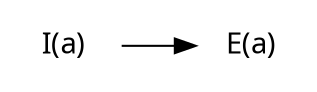
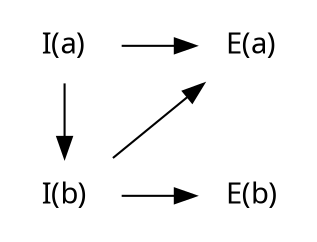
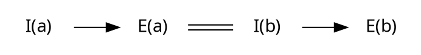
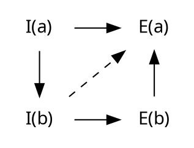
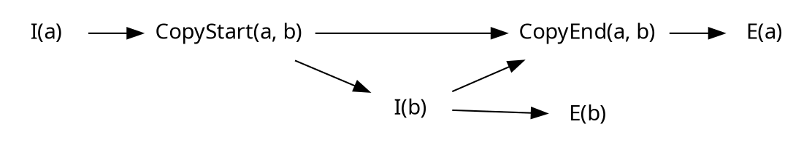
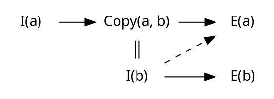

# Refining the Rust type system

<!--toc:start-->
- [Refining the Rust type system](#refining-the-rust-type-system)
  - [Introduction](#introduction)
  - [How do lifetimes work?](#how-do-lifetimes-work)
<!--toc:end-->

## Introduction

Today various issues related to coroutines, Send, Sync, unforgettable types, async drop plague the Rust type system.
Developers of the Rust language commonly seek solutions only to implement a patchwork in a grand scheme of things.
When it comes to design of new major language features, language designers might do something "because it doesn't seem to be wrong to do".
This in turn require patchwork solutions, if such thing even possible.
If you find this paragraph to touch some of the rust-lang design pain points, you might be interested in the subject of this text.

Many people have tackled with the problems such as:

- Self-referential types
- Thread-safe coroutines with `!Send` locals
- Unforgettable and immovable types

I believe I have found a strong framework for designing such difficult features.
**Be warned: I will be using a bit of the Category Theory to describe some arising constructions, but I'll try making it clear if you are unfamiliar with it.**
I hope you will consider it in your further work.
So let's start from the begining.

## How do lifetimes work?

You may have heard, that Rust type system was inspired by the [Cyclone language].
It was a research project, which have implemented a clever region-based memory managment, which relates to the common understanding of how lifetimes work.
To recap: Rust compiler associates each lifetime token to a certain scope, where an object can live until the end of the scope.

Things changes a bit after introduction of [Non-lexical lifetimes].
Scopes were redefined in terms of the control-flow instead of the literal source code in order to lift unnecessary restrictions from safe code.
But what are the "necessary" restrictions in the first place?

### Order of events

Let's try visualize lifetime of some object \\(a\\) using, what I would call, *events*:

The events \\(I(a)\\) and \\(E(a)\\) respectivelly stands for the *introduction* of variable \\(a\\) and its *elimination*.
The arrow represents timeflow: elimination of a variable may occure **only after** its introduction.
This relation can be also described as a strict comparison \\(I(a) < E(a)\\), forming a *[strict partial order]* over those events.
The comparison's strictness allows to verify event order requirements as long as \\(X < X\\) relation cannot be derived, which usually mean there's a cycle of arrows.
As such you may remember property of comparisons called *transitivity*: \\(X < Z\\) if \\(X < Y\\) and \\(Y < Z\\).
So there could be as many hidden arrows as this rule allows, and to emphisize some of these, they are shown as dashed ones.
Later the notion of equality (\\(X = Y\\)) will also play a role of events occuring at the same moment.

### Examples

To copy or move a variable \\(b := a\\), an additional requirement \\(I(a) < I(b) < E(a)\\) should be put on the order of those events,
meaning variable \\(a\\) must exists at the moment of creation of \\(b\\):

And you could express that constructor of \\(b\\) consumes \\(a\\) with \\(I(b) = E(a)\\):

To immutably borrow a variable \\(b = \\&a\\), the order \\(I(a) < I(b) < E(b) < E(a)\\) have to be a requirement:

Notice that the previous requirement \\(I(b) < E(a)\\) we had for copies is recovered via transitivity.
So if you compare these two diagrams, you will notice \\(E(b) < E(a)\\) standing out.
This relation is enforsed specifically with the Rust's borrow checker.

However those are not enought to model every possible interaction with values or objects in Rust.
The notion of *unique borrow*, *shared borrow* and *owned value* gives enough expressiveness to the language.
But combining those is more complicated than giving sensible rules for order of variable introductions and eliminations.

[Cyclone language]: https://cyclone.thelanguage.org/
[Non-lexical lifetimes]: https://smallcultfollowing.com/babysteps/blog/2016/04/27/non-lexical-lifetimes-introduction/
[strict partial order]: https://en.wikipedia.org/wiki/Partially_ordered_set
[ZST]: https://doc.rust-lang.org/nomicon/exotic-sizes.html#zero-sized-types-zsts
